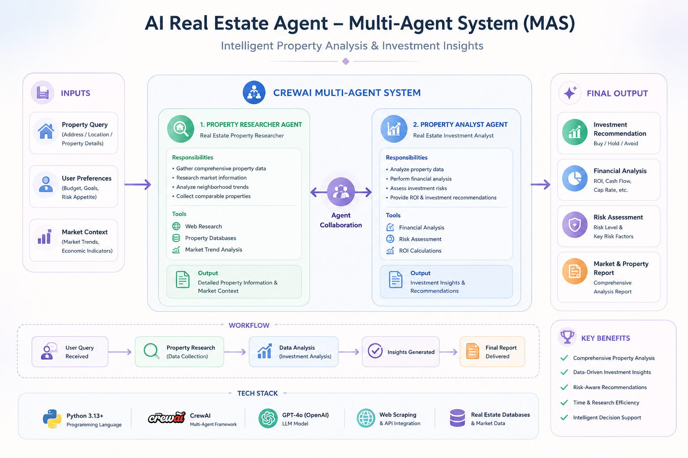

# AI Real Estate Agent - Multi-Agent System (MAS)

A sophisticated multi-agent system built with CrewAI that leverages AI to analyze real estate properties and provide intelligent insights for property evaluation and investment analysis.

## 🎯 Overview

This project implements a collaborative multi-agent architecture where specialized AI agents work together to research, analyze, and evaluate real estate properties. The system combines property data gathering with advanced analytical capabilities to provide comprehensive real estate insights.

## 🤖 Agent Architecture

### 1. **Property Researcher Agent**
- **Role**: Real Estate Property Researcher
- **Responsibility**: Gathers comprehensive property data and market information
- **Tools**: Web research, property database queries, market trend analysis
- **Output**: Detailed property information and market context

### 2. **Property Analyst Agent**
- **Role**: Real Estate Investment Analyst
- **Responsibility**: Analyzes property data and provides investment recommendations
- **Tools**: Financial analysis, risk assessment, ROI calculations
- **Output**: Investment insights and recommendations

## 🛠️ Tech Stack

- **Language**: Python 3.13+
- **Framework**: CrewAI
- **LLM Model**: GPT-4o (OpenAI)
- **API Integration**: Web scraping, real estate databases
